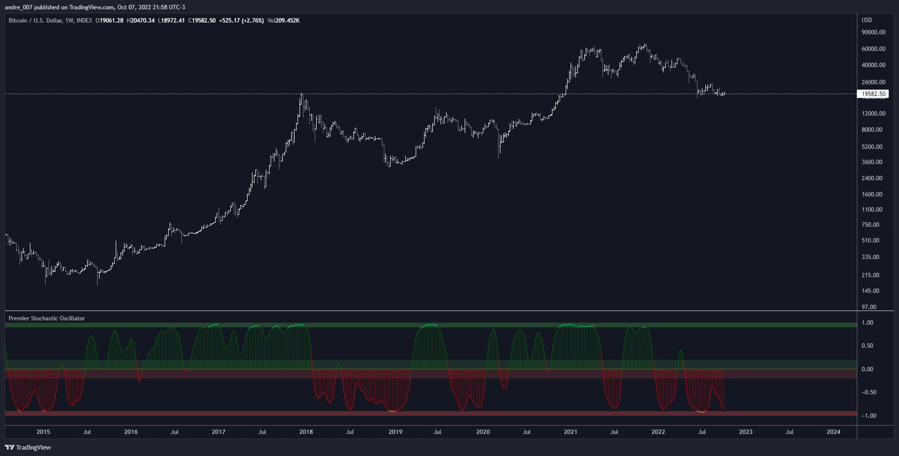

# Premier Stochastic Oscillator (PSO)

This is a improved version of Premier Stochastic Oscillator ( PSO ), coded by "LazyBear".

"The indicator was first introduced by technical analyst Lee Leibfarth in the August 2008 issue of the journal Technical Analysis of Stocks & Commodities".

Inprovements:

- The script was update to version 4 of PineScript.

- Added support for diferents times frames.

- For example, now it's possible to stay in intraday and at same time see a weekly version of this indicator.

- Possibility to customize the thresholds.

## Introduction to indicator

"Stochastic oscillators have long been used to help traders and investors identify areas where trend changes are likely.
Leibfarth developed the PSO to take advantage of a standard stochastic oscillator's strengths while enhancing it to become more reactive to market activity.
The result is a faster indicator that provides earlier signals for potential trend changes".

More info:
[Investopedia](https://www.investopedia.com/articles/trading/10/premier_stochastic_oscillator_explained.asp)

## More Detais
I've implemented some fine tuning for visibility.

When the indicator is in the 'overbought' or 'oversold' areas, the color will be highlighted.

Furthermore, I think I owed the more detailed description of how to use this indicator.
Then move on.

## What to look for

According to Lee Leibfarth's paper:
" the PSO is best suited for trading changes in market direction (countertrend trading)

The thresholds are defined by horizontal lines at +/-0.20 and +/-0.90.
These thresholds create two symmetric buy and sell areas with the following rules:

Long trades:
(1) Premier stochastic crosses below 0.90,

(2) premier stochastic crosses below 0.20

Short trades:

(1) Premier stochastic crosses above -0.90,

(2) premier stochastic crosses above -0.20~
"

However, we can adapt this indicator to our own trading system, and nothing prevents us from using a trend movement, instead of counter-trend mentioned by the author.

It is noteworthy that the probability of winning increases if we use this indicator in conjunction with other tools, such as using a longer timeframe in parallel along with a price-action analysis.

## Donations

- Bitcoin: 3AK6MxX93czQraP4AFv1wKYDvPnPipgF51
- Dash: XuSnX2YgsGVcfKY24TtndBu5X7tZShPTC7
- LiteCoin: MQEmwEqLA3WUsuQ1E6u8wDxzUrDRotZyH8
